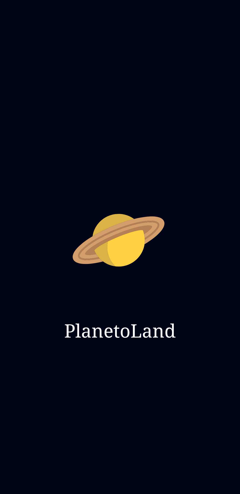
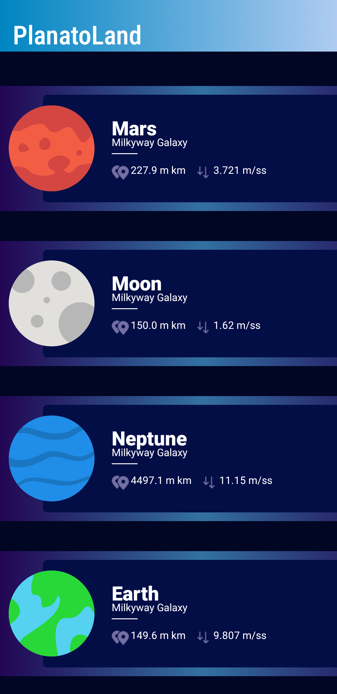
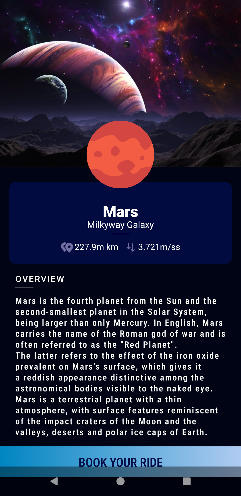
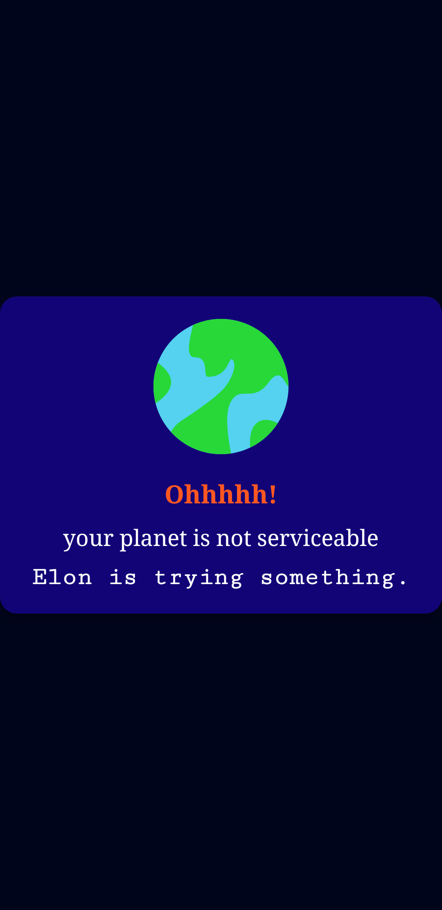

<h3 align="centre"> 
     Hope you all are doing well 
</h3> 
<h3 align ="centre">Let's Have a look on my PlanetoApp</h3> 

# Prerequisite
* Android Studio installed in your system.
   

🚀 Language used in creating this is Kotlin 
  
  
⚡**UI** of PlanetoApp
 

  

  

  
</h4>

  

  

### 🙋‍♂️ Hope you like my app .If you like don't forget to like the repository  

<h4 align= "centre">If you are facing any issue then free to contact me through email</h2>

- 📫Email : bhawnabc2002@gmail.com
  
  
<h3 align="centre"> 
     Thanks for being here
</h3>